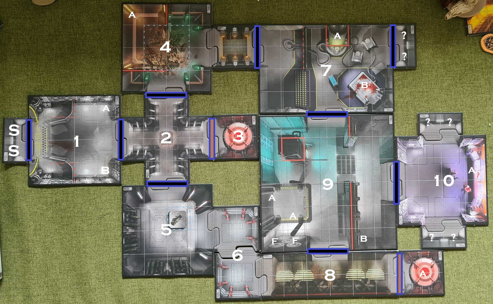

# Mission 1 - Containment

## Brief

> Two days ago we started getting a distress call on a loop from someone claiming to be a UAC operative at a facility in the Valles Marineris. Let me be clear, this facility does not exist. We're sending you in there to confirm this fact and silence this erroneous message. Should you encounter any personnel on site, they should be secured and brought back for questioning. We need to know who is trying to torpedo the UAC's efforts to recover its scientific pursuits on Mars, and silence this espionage before it gets into the hands of the UN.

## Objectives

### Marines

- Destroy or disable the communication
- Detain any site personnel

### Demons

- 6 Frags

## Gear

It is recommended that the Marines start with the Static Rifle, Combat Shotgun, Plasma Rifle and Burst Rifle, with Fire Support and Stealth Operative class cards.

Demons each get 1 argent energy to start and at the end of each round. The demon player chooses their set of event cards.

## Layout - not known by the marines

## 1. Airlock Control

The marines start in the airlock marked `S`. The airlock control room (`1`) is visible to them despite the closed door.

### Before entry

> The concealed door outside bore no UAC markings, but through the clouded port on the inner door you see what looks to be a familiar corporation airlock control room. The lights are out but something seems to be shuffling around in there...

### On entry

Place a Possessed Soldier and Marine Charlie in spots marked `A` and `B`. Place one demon initiative randomly in the remaining initiative deck.

> As the inner door opens, the emergency strip lights flicker on. On one side of the room a lump of twisted bleeding flesh and metal begins to stir despite its injuries. On the other, a man in a full VAC suit (presumably heading for the airlock) wields a blood spattered chainsaw (presumably what did the injuring). He waives it erratically indicating something, but his shouts are reduced to mumbles by his suit and helmet.

Marine Charlie is actually also a Possessed Soldier. He will attack the marines given the chance. When defeated he drops the chainsaw weapon token and regains his humanity:

> As his red eyes fade, humanity returns to the mans face. He speaks more calmly now and explains, "The facility studies long range teleportation. We had broken through; teleported living creatures hundreds of miles and back. But as soon as the first human went through, 'creatures' started coming back. It warped peoples minds, changed their bodies, turned them crazy. We tried to sever the power but the command centre clearly has backup generators we weren't told about. The route to the command centre is left through the lab. The armoury has service duct access but its dangerous and I'm pretty sure the creatures have been using the ducts to get around. Don't whatever you do open the teleporter doors." With that he expires.

## 2. Annex

> Ahead is a sign marked _Auxillary Translocation Pod_ with a defaced door. To the left a sign marked _Laboratory_ and to the right _Armoury_.

## 3. Auxillary Translocation Pod

> A flash of glowing red light fills your retinas. When they finally recover, two glowing embers remain: Two burning eyes in a snarling skull that lunges towards you. Above it, floats something much, much worse.

Place one Pinky and one Cacodemon adding initiative cards if necessary.

## 4. Laboratory Holding Pens

Place 4 Possessed Soldiers in squares adjacent to `A`.

> In the back corner, the pens that used to hold the teleportation test subjects now brim with the same twisted beasts as the one you found in airlock control. It appears they are ex-personnel, some still wearing lab coats and ID cards over their twisted modifications. Just as you thank your luck that the containment field is on the backup generators, something bursts out of a vent above and the rubble destroys the power relay, knocking out the containment completely.

The first Marine in the room suffers 3 damage from falling rubble. Place two Imps in any location in the room adding initiative cards if necessary.

## 5. Armoury

> The Armoury is a dead end apart from a smallish service duct funnelling in the sound of a faulty air circulator. Along the walls are rows of empty gun racks. Either this facility is severely under-stocked or somebody went full Rambo in here. A med-pack, a pack of grenades and a solitary heavy assault rifle remain. The door lets out a worrying groan as it shuts behind you, but more worrying is that "faulty fan" noise seems to be getting closer.

Close the door. Place the assault rifle, grenade and med pack. The Marine player can choose to swap a weapon for the assault rifle. The demon player can now choose whether or not the armoury door opens when a player attempts to use it. If not it still costs a movement point.

## 6. Service Ducts

> The duct crackles with electricity. Clearly, the backup power system was installed hastily and against UAC procedures. Whilst the flashes occasionally light the way, one wrong move is going to result in a nasty jolt. Whats more, you start to think you're not the only one in here...

Once per Marine and per entry to the ducts, the demon player decides if and when the following happen:

- Two Imps appear in the ducts
- The Marine player becomes stunned by electric

## 7. Laboratory

> The lab platform is raised, no doubt to accommodate the spaghetti of cables feeding the humming machines. One appears to be a large stasis pod in which a floating skull can barely be made out through the viscous fluid. On the bloody operating table, a creature struggles violently against its restraints.

Place a frag token on the spot marked `A` to represent the skull demon. Lay an Imp on the spot marked `B`. Only the Imp can attack/be attacked but add initiative cards for both the Imp and the skull. The demon player can swap the skull for a revenant when they choose:

> The damaged containment field in the holding pens explodes. The power surge shorts out the entire lab and the stasis fluid is instantly evaporated revealing more than just a flayed skull.

The holding pens (`4`) and the connecting hall are now on fire. Place a threat token to indicate this. Any creature or player in that room or subsequently entering it takes 3 damage.

## 8. Primary Translocation Pod

> This is the hall housing the primary translocation experiment. Heavy fans swing in unison but there is still intense heat in the air. Consoles begin to flicker, generators whir up and an immense discharge of power can be heard behind the defaced door ahead.

A Mancubus is teleported in to the spot marked `A`. Add its initiative card but only place it when the door is opened either by the Marine or the demon player on their turn.

## 9. Operations

> The operations room was clearly being used to prepare and recover materials for teleport. A destroyed service elevator presumably used to access an upper storage level, now just a black hole in the ceiling. From it though, floating green eyes begin to descend with ominous intent. On the adjacent wall however, some volatile fuel cells appear to be usefully pointing toward them.

Place 2 Cacodemons in the spots marked `A`. In the spot marked `B` a Pinky is lying in wait. Add both their initiative cards as necessary. Place the Pinky only when a Marine gains line of sight.

A Marine can choose to shoot the fuel cells (`F`). If either cell receives 3 or more damage both cells shoot horizontally to the opposite wall dealing 3 damage to each creature or player in their path.

## 10. Command centre

> It took a swift bypass to access the command centre, but once in you see a haggard man in a wheelchair. The terminal he is next to is smashed but your suit identifies the lines feeding power to the system in a panel under the console. He pleads with you to leave it running as its the last thing supplying power to the facility.

Place an objective token on `A` representing the power lines and one adjacent to it representing the man. A Marine can capture the man and/or sever the power by landing on the respective tokens.

### If the power is severed

> That backup generator was clearly propping up some vital system as moments after the console dies a explosion rocks the laboratory. On failsafe discharge you hear all the doors resetting to an open state and then all manor of commotion funnelling through them into operations.

The Laboratory is now on fire. Place a threat token to indicate this. Any creature or player in that room or subsequently entering it takes 3 damage.

Open all doors. Spawn any demons from the teleporters not already triggered.

Place 2 Cacodemons and 3 Imps in Operations (9) in squares on or adjacent to those marked `A`.

## End Game

Keep spawning lesser demons each round from the telporters to keep things interesting. As soon as one Marine makes it back to airlock control (`1`):

> The explosions must have triggered a cave-in. The airlock is completely blocked. I guess thats why they don't normally build facilities in 7 kilometer deep trenches. You doubt there's much time left before the whole thing implodes and the only thing left working is those infernal teleporters. Well, they have to go somewhere... right?

Spawn a baron of hell in the Auxillary Translocation Pod (`3`). Once both Marines reach either teleporter the mission is complete.
