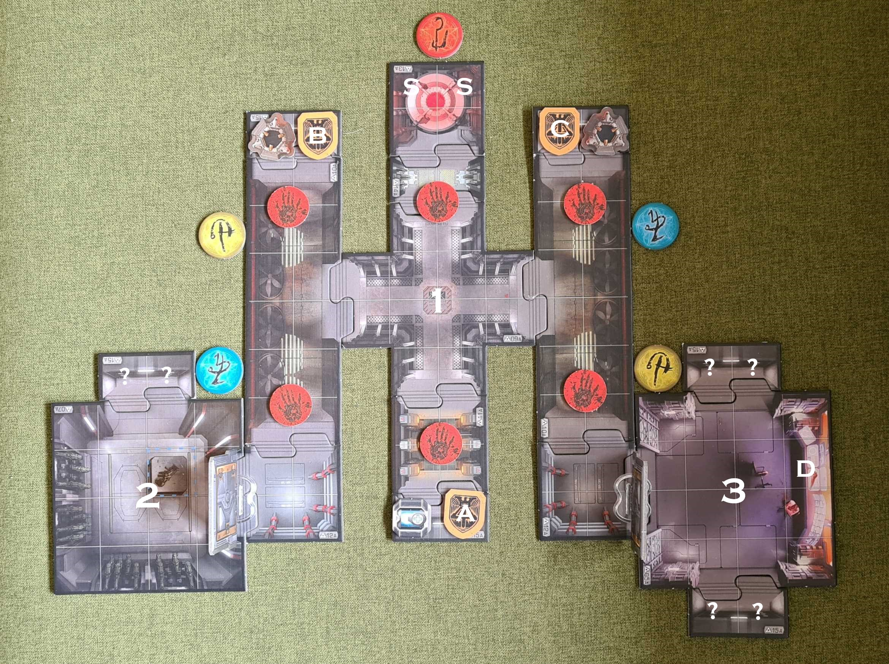

# Mission 2 - Survival

## Brief

This assumed the players completed mission 1 successfully. If not you can replay it or skip straight to this mission as if they did.

> You half expected to materialize in the underworld based on the things coming out of that teleporter, but as it was your only way to escape, you bravely stepped in. To your surprise you came to in another distinctly UAC-built facility. The scientist accompanying you wheels over to the console and downloads the auto-map to your suits.

## Objectives

### Marines

- Secure the facility
- Find a way to escape

### Demons

- 6 Frags

## Gear

The marines start with equipment they had or gained in mission 1 with the exception of the chainsaw which has run out of gas.

The demon player uses the standard rules for invasion card _Assault_, threat card _Deadly Force_ and chooses their set of event cards. The demon player first spawns when a player reaches the centre of the facility Annex (`1`).

## Layout

The facility layout is known to the marines (see briefing) so set the whole thing up this time. The threat tokens are placed on intersections of four spaces and their affects and that of the objective tokens are revealed during the game. The teleporters are Marine spawn-in points only and cannot be used to travel between each other. The portals all begin face up. They can be used as per the rules for invasion card _Assault_ to spawn in any space they are adjacent to. The Marines start in the teleporter marked `S`. Place a figure representing the scientist on the spot marked A.

## 1. Annex

> Just as you reach the centre of the annex a rush of air sucks in from both sides. You hear a familiar crackle from the teleporter and look back to see more horrors have arrived. The scientist screams to shut it down in the Control Room. "I can only approve access to the Control room and the Armoury from this console, the other two consoles control security systems. Get going and I'll let you in."

The demon player spawns and adds in the necessary initiative cards at random. Then the Marine continues their turn.

### A. Approval Console

When either Marine first wishes to gain access to the Armoury or Control:

> Instead of the sound of grav-locks releasing you hear a blood curdling scream coming over the intercom...

The scientist is killed by a demon (feel free to add a small one to sell this if necessary). Now the only way the marines can open the door is if one of them gets back to the console.

If one Marine is stood adjacent to a door and the other is on the spot marked `A` the door will permanently open.

### B. & C. Security Consoles

Revealed if a Marine is on or adjacent to the console.

> It looks like the console activates a high powered energy beam designed to vaporize organic material outside of the secure rooms. But the console is damaged so you cant control it precisely.

If a Marine lands on `B` they can choose to activate the system once per activation.

When activated:

1. Choose a row of threat tokens either: `Top` (nearest the consoles `B, C` and teleporter `S`) or `Bottom` (nearest the secure rooms `1, 2` and console `A`).
2. Now flip a threat token out the box. If it lands on the UAC side the choice stands otherwise the demon player may change the choice.
3. The Marine may now choose to activate all beams in that set or a specific one. If they choose a specific one flip a threat token as before to give the demon player the chance to change the outcome.
4. Any demon within four spaces either side of an activated threat token suffers 5 damage, similarly any Marine within range suffers 3 damage.

Console `C` is the same except the player chooses a column instead of a row of threat tokens to activate in step one (`Left`, `Middle` or `Right`)

## 2. Armoury

Once opened place the _Siphon Field_, _Hologram_, _Super Shotgun_ and _Chaingun_ tokens in the Armoury. A Marine can swap a weapon for the _Super Shotgun_ (and if so optionally swap their class to _Close Combat Specialist_). All other tokens behave as normal.

## 3. Control

Once opened place an objective token on the spot marked `D`. This represents power control. If a marine lands on it:

> The security monitor shows the teleporter powering down but just as the last ember of argent power flickers out the whole pod explodes, severely damaging the facility. The exit teleporters are gone. Again, your only chance is the main teleporter which is still glowing despite the explosion.

Flip the teleporter map section (`13a`) to its other side (`13b`). This is the exit for the map. You can end the game now or have the Marines fight their way back to the teleporter with more demons and a severely malfunctioning security system:

Every time a figure enters the range of a threat token (4 spaces either side) roll two black attack dice. The number shown corresponds to the token activated starting at 1 for the top left token and going clockwise to 6 for the bottom left token. Damage is applied to all figures in range of the activated token as before.
